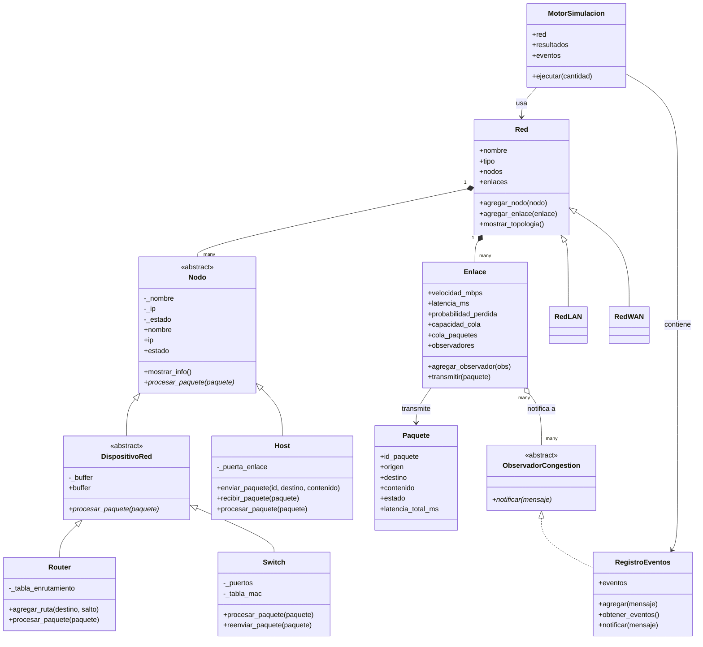
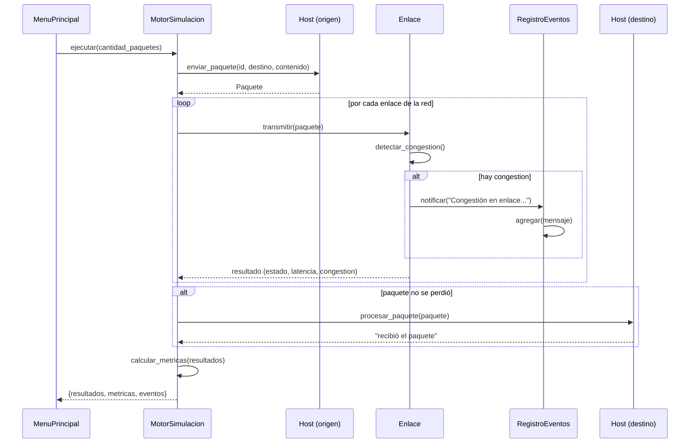

# Diagramas UML - RedCom Analytic

## Diagrama de clases

```mermaid
classDiagram
    class Nodo {
        <<abstract>>
        -_nombre
        -_ip
        -_estado
        +nombre
        +ip
        +estado
        +mostrar_info()
        +procesar_paquete(paquete)*
    }

    class DispositivoRed {
        <<abstract>>
        -_buffer
        +buffer
        +procesar_paquete(paquete)*
    }

    class Host {
        -_puerta_enlace
        +enviar_paquete(id, destino, contenido)
        +recibir_paquete(paquete)
        +procesar_paquete(paquete)
    }

    class Router {
        -_tabla_enrutamiento
        +agregar_ruta(destino, salto)
        +procesar_paquete(paquete)
    }

    class Switch {
        -_puertos
        -_tabla_mac
        +procesar_paquete(paquete)
        +reenviar_paquete(paquete)
    }

    class Paquete {
        +id_paquete
        +origen
        +destino
        +contenido
        +estado
        +latencia_total_ms
    }

    class Enlace {
        +velocidad_mbps
        +latencia_ms
        +probabilidad_perdida
        +capacidad_cola
        +cola_paquetes
        +observadores
        +agregar_observador(obs)
        +transmitir(paquete)
    }

    class ObservadorCongestion {
        <<abstract>>
        +notificar(mensaje)*
    }

    class RegistroEventos {
        +eventos
        +agregar(mensaje)
        +obtener_eventos()
        +notificar(mensaje)
    }

    class Red {
        +nombre
        +tipo
        +nodos
        +enlaces
        +agregar_nodo(nodo)
        +agregar_enlace(enlace)
        +mostrar_topologia()
    }

    class RedLAN
    class RedWAN

    class MotorSimulacion {
        +red
        +resultados
        +eventos
        +ejecutar(cantidad)
    }

    Nodo <|-- DispositivoRed
    Nodo <|-- Host
    DispositivoRed <|-- Router
    DispositivoRed <|-- Switch
    Red <|-- RedLAN
    Red <|-- RedWAN
    ObservadorCongestion <|.. RegistroEventos
    Red "1" *-- "many" Nodo
    Red "1" *-- "many" Enlace
    Enlace "many" o-- "many" ObservadorCongestion : notifica a
    Enlace --> Paquete : transmite
    MotorSimulacion --> Red : usa
    MotorSimulacion --> RegistroEventos : contiene
```

## Diagrama de secuencia: envío de un paquete

```mermaid
sequenceDiagram
    participant Menu as MenuPrincipal
    participant Motor as MotorSimulacion
    participant Origen as Host (origen)
    participant Enlace1 as Enlace
    participant Obs as RegistroEventos
    participant Destino as Host (destino)

    Menu->>Motor: ejecutar(cantidad_paquetes)
    Motor->>Origen: enviar_paquete(id, destino, contenido)
    Origen-->>Motor: Paquete

    loop por cada enlace de la red
        Motor->>Enlace1: transmitir(paquete)
        Enlace1->>Enlace1: detectar_congestion()
        alt hay congestion
            Enlace1->>Obs: notificar("Congestión en enlace...")
            Obs->>Obs: agregar(mensaje)
        end
        Enlace1-->>Motor: resultado (estado, latencia, congestion)
    end

    alt paquete no se perdió
        Motor->>Destino: procesar_paquete(paquete)
        Destino-->>Motor: "recibió el paquete"
    end

    Motor->>Motor: calcular_metricas(resultados)
    Motor-->>Menu: {resultados, metricas, eventos}
```
